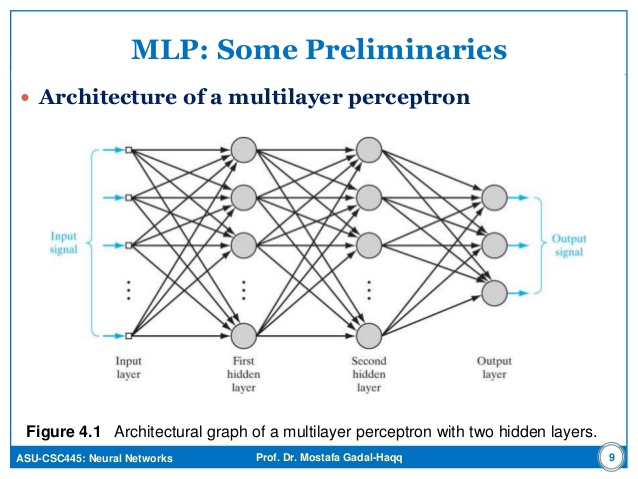

# Dense Neural Network

# Dense Neural Network Model for Classifying Fashion MNIST Dataset

This project utilizes a Dense Neural Network to classify images from the Fashion MNIST dataset. The goal is to accurately identify different types of fashion products, such as clothing and accessories, from grayscale images.

## Dataset Overview

The Fashion MNIST dataset is a modern alternative to the classic MNIST dataset, often used as a benchmark for machine learning algorithms. It includes:

- 60,000 training images
- 10,000 testing images
- Images are grayscale, 28x28 pixels
- 10 distinct fashion categories

### Data Source

The dataset is readily available through TensorFlow/Keras: `tensorflow.keras.datasets.fashion_mnist`

## Dense Neural Network Model

A Dense Neural Network, or a fully connected neural network, is used in this project. It consists of multiple layers where each neuron is connected to all neurons in the previous and subsequent layers. 

### Implementation

The network is implemented in Python, using TensorFlow for building and training the neural network. Additional libraries such as NumPy and Matplotlib are utilized for numerical operations and visualizations.

### Key Features of the Implementation

- Data preprocessing includes normalization and flattening of images, along with one-hot encoding of labels.
- The model's architecture is flexible, allowing for experimentation with different numbers of layers and nodes.
- The network uses the sigmoid activation function and mean squared error as the cost function.
- Training involves stochastic gradient descent and backpropagation for error minimization.

## Results and Observations

- The network shows a decreasing trend in error with each training epoch.
- Initial experiments with a simple network architecture resulted in around 85% accuracy.
- Further experiments with a more complex network architecture did not significantly improve accuracy, indicating potential overfitting.

## Conclusion and Future Work

The project demonstrates the effectiveness of Dense Neural Networks in image classification tasks. Future work could explore:
 
- Fine-tuning network parameters and architecture
- Implementing regularization techniques to combat overfitting
- Comparing performance with other types of neural networks

---

For a detailed walkthrough of the implementation and results, please refer to the Jupyter notebook in this repository.
